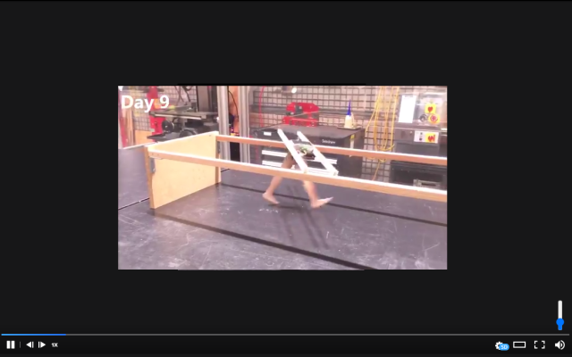

# Gfycat Volume Control
A Chrome extension that adds a volume slider to Gfycat gifs with sound.

[Get on the Chrome Web Store](https://chrome.google.com/webstore/detail/gfycat-volume-control/kbmgipmgemeiiglekhhfdnlldbjhgjff)

## TODO and Ideas
- [ ] Save mute/unmute state? By default Gfycat starts all sound gifs muted, but we might want to start the gif in the last remembered state.
- [ ] Doesn't currently work on gallery view (i.e., the "explore" tab). I guess if people actually use this feature I can support it.